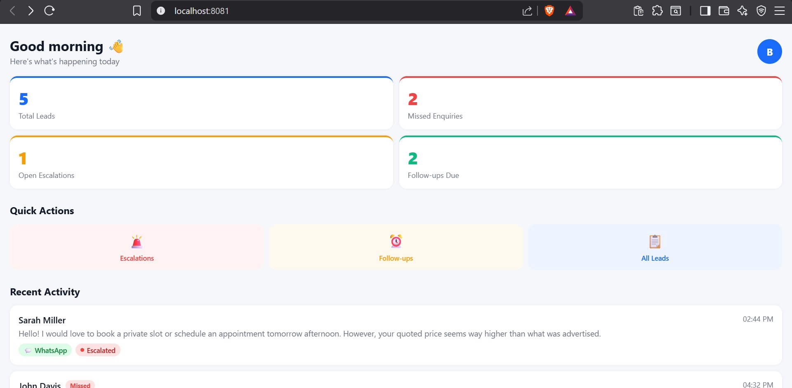
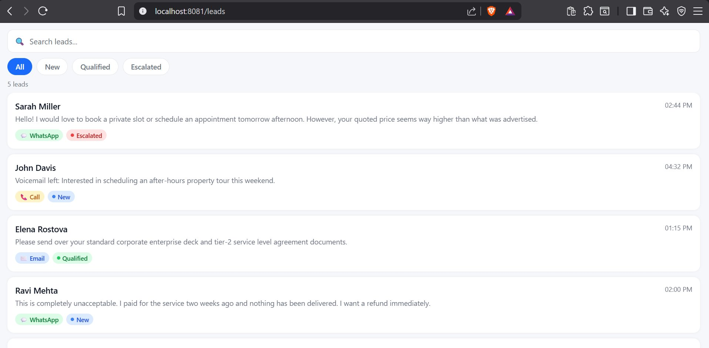
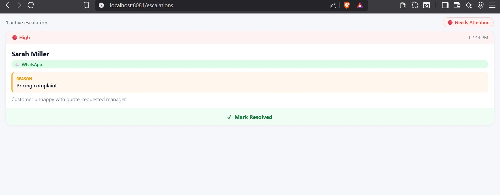
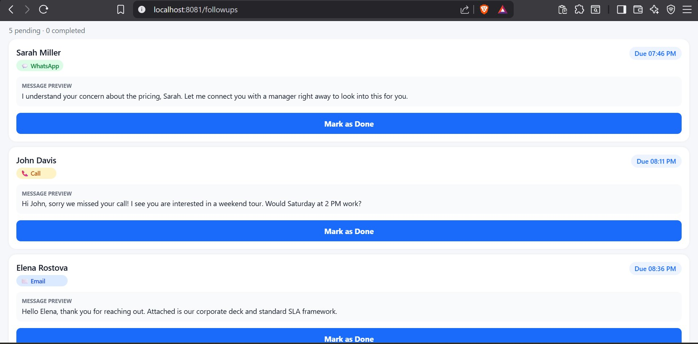

# Closira Core — Full Stack Submission

> Built for the Closira Engineering Intern Assignment — completing **both** the Backend and Frontend tracks.

Closira is an AI-powered customer communication platform for SMBs. This repository contains the backend API service that handles inbound enquiries asynchronously, and the mobile dashboard frontend that lets business owners monitor and act on conversations in real time.

---

## Repository Structure

```
closira-core/
├── backend/          Python · FastAPI · SQLite · BackgroundTasks · structlog
└── mobile-app/       React Native · Expo · Expo Router
```

---

## Backend — REST API + Async Worker

### Setup & Run

```bash
cd backend

# Create and activate virtual environment
python -m venv venv
venv\Scripts\Activate.ps1        # Windows PowerShell
source venv/bin/activate          # macOS / Linux

pip install -r requirements.txt
uvicorn app.main:app --reload
```

- Interactive API docs → **http://localhost:8000/docs**
- Health check → **http://localhost:8000/health**

### Run Pipeline Smoke Test

```bash
# From /backend directory
python verify_pipeline.py
```

Expected output:
```
============================================================
  1 / 5  HEALTH CHECK          ✅ Healthy
  2 / 5  CREATE ENQUIRY        ✅ Accepted → job_id=enq_xxxxxxxx
  3 / 5  FETCH HISTORY         ✅ SOP matched, 2 timeline events
  4 / 5  SCHEDULE FOLLOW-UP    ✅ Follow-up registered
  5 / 5  ESCALATE              ✅ Status → escalated
  ALL PIPELINE STAGES VERIFIED
============================================================
```

### API Endpoints

| Method | Endpoint | Description |
|--------|----------|-------------|
| `GET` | `/health` | API status + database connectivity |
| `POST` | `/enquiry` | Ingest enquiry, returns `job_id` immediately — non-blocking |
| `POST` | `/enquiry/{id}/follow-up` | Schedule follow-up with delay + optional template |
| `POST` | `/enquiry/{id}/escalate` | Escalate to human agent with reason |
| `GET` | `/enquiry/{id}/history` | Full conversation history + status timeline |

### How the Async Worker Works

1. Enquiry hits `POST /enquiry` — saved to DB, `job_id` returned immediately
2. BackgroundTask fires in parallel — never blocks the API response
3. Worker normalises the message and scans it against 5 SOPs using regex
4. Enquiry record updated with matched SOP + suggested response
5. If no SOP matches → auto-escalated, event logged

### SOP Registry

| SOP | Trigger Keywords | Result |
|-----|-----------------|--------|
| `booking_enquiry` | book, reserve, appointment, schedule, slot, tour | Qualified |
| `pricing_question` | price, cost, quote, how much, rate, tariff, fee | Qualified |
| `complaint` | broken, fail, issue, unhappy, error, complaint, refund | Qualified |
| `after_hours` | closed, midnight, weekend, holiday, after-hours | Qualified |
| `general_information` | info, brochure, catalogue, document, deck, sla | Qualified |
| *(no match)* | — | Auto-Escalated |

### Database Schema

```
Enquiry
├── id                TEXT  PRIMARY KEY   e.g. "enq_a1b2c3d4"
├── channel           TEXT  ENUM(WhatsApp, email, call)
├── customer_name     TEXT  INDEXED
├── message           TEXT
├── status            TEXT  ENUM(new, qualified, escalated)
├── matched_sop       TEXT  NULLABLE
├── suggested_response TEXT  NULLABLE
├── escalation_reason TEXT  NULLABLE
├── created_at        DATETIME
└── timeline          JSON  append-only event log
```

### Key Design Decisions

**SQLite over PostgreSQL**

SQLite with WAL (Write-Ahead Logging) mode allows concurrent reads alongside the background writer — exactly this service's access pattern. Zero infrastructure for a prototype; switching to PostgreSQL is a one-line URL change. The SQLModel ORM layer abstracts this completely.

**BackgroundTasks over Celery**

| Factor | BackgroundTasks ✅ | Celery |
|--------|-------------------|--------|
| Infrastructure | None — in-process | Redis/RabbitMQ broker + worker |
| Latency | Near-zero | Network hop |
| Durability | Lost on crash | Persisted in broker |
| Fit | Ideal for prototype | Overkill |

Trade-off acknowledged: no retry on crash. Production path → Celery + Redis + `max_retries=3`.

### Structured Logging

```json
{"event": "enquiry.created",    "enquiry_id": "enq_a1b2c3d4", "channel": "WhatsApp"}
{"event": "worker.sop_matched", "enquiry_id": "enq_a1b2c3d4", "sop": "booking_enquiry"}
{"event": "enquiry.escalated",  "enquiry_id": "enq_a1b2c3d4", "reason": "No SOP matched"}
```

### API Test File

Open `backend/api_tests.http` in VS Code with the REST Client extension to run all endpoints with example payloads including error cases (404, 422, missing fields).

---

## Frontend — Mobile Dashboard

### Setup & Run

```bash
cd mobile-app
npm install --legacy-peer-deps
npx expo start --web    # opens at http://localhost:8081
```

Scan the QR code with **Expo Go** on your phone, or press `w` to open in browser.

### Screens

| Screen | What it shows |
|--------|--------------|
| **Dashboard** | 4 stat cards (total leads, missed enquiries, open escalations, follow-ups due), quick-action buttons, activity feed |
| **Leads** | Searchable + filterable list, channel badges, status indicators, tappable cards |
| **Escalations** | Urgency-sorted alerts, colour-coded strips, resolve with confirmation |
| **Follow-ups** | Task cards with due times, message preview, mark-as-done |
| **Conversation Detail** | Message thread, SOP label, AI summary, suggested response, status timeline |

### Screenshots

| Dashboard | Leads |
|-----------|-------|
|  |  |

| Escalations | Follow-ups |
|-------------|------------|
|  |  |

### Design System

- **Channel badges:** WhatsApp → green · Email → blue · Call → amber
- **Status indicators:** New → blue · Qualified → green · Escalated → red
- **Urgency sorting:** Escalations screen sorts High → Medium → Low automatically
- **Empty states:** all lists handle empty data with contextual messages
- **Resolve flow:** confirmation alert before marking resolved — prevents accidental taps

### Styling Decision — StyleSheet over NativeWind

NativeWind requires a Tailwind compiler pass and additional Babel config. For a prototype that must run reliably on both iOS and Android with zero build friction, React Native's `StyleSheet` is more predictable — full type safety, no class-string typos, identical runtime performance.

### Mock Data

Located at `mobile-app/mock/enquiries.json` — 5 realistic entries structured exactly like a real API response: same field names as the backend schema, ISO 8601 timestamps, nested timeline arrays. Connecting to the real backend is a one-line change per screen.

---

## Known Limitations & Production Path

| Area | Current | Production Path |
|------|---------|----------------|
| Task durability | BackgroundTasks lost on crash | Celery + Redis + `max_retries=3` |
| SOP matching | Keyword regex | Embeddings-based semantic matching |
| Database | SQLite single-process | PostgreSQL + pgBouncer pooling |
| Auth | None | JWT per tenant + Expo SecureStore |
| Multi-tenancy | No `tenant_id` | One-column migration, filter all queries |
| Push alerts | Not implemented | Expo Notifications for escalations |

---

## Video Walkthrough

[Link to video walkthrough]

---

*Full-stack submission — Backend + Frontend — Closira Engineering Intern Assignment.*
